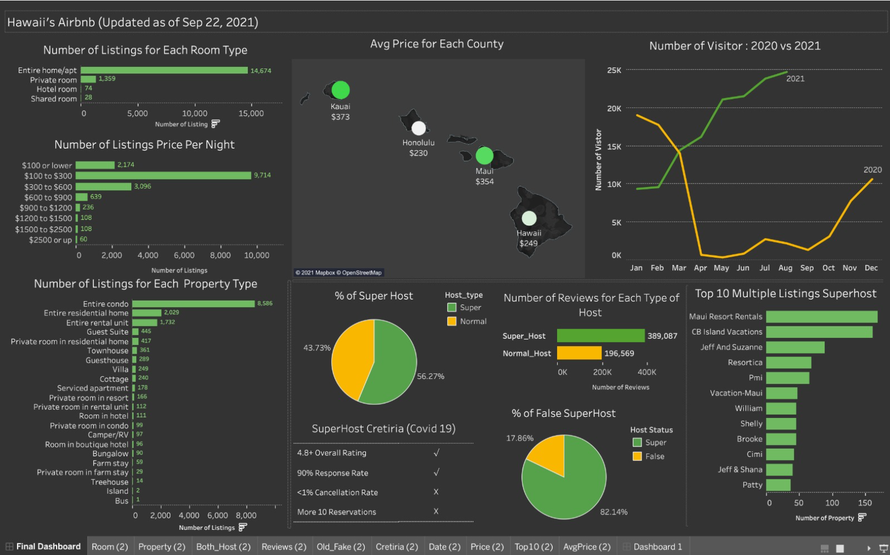

# Airbnb Analysis in Tableau

### Project Description
We analyzed Airbnb data in Hawaii and made a dashboard in Tableau.

### Project Coding/Softwares

* Python
* Tableau

### Data Source
You can find all the data in InsideAirbnb.
We used listings.csv.gz and reviews.csv.gz on Sep 22, 2021, and Jan 14, 2021 in Python.
http://insideairbnb.com/get-the-data.html

